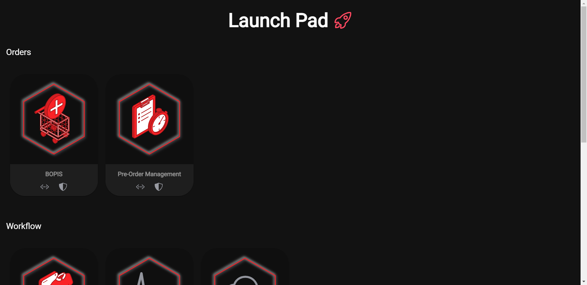

 

# About

HotWax Commerce provides retailers with the best return on their inventory by facilitating omnichannel retailing strategies such as same-day Buy Online Pick-Up In Store (BOPIS), Ship From Store, and Pre-Orders in order to increase conversion rates and profitability. Launchpad is another sub repo of HowWax

## Getting started
### Clone the repository (code)

- Fork the repository

- Open a Terminal window

- Clone Launchpad 

- Run following command to download dependencies 

    `npm i` OR `npm install` 

### Run App

- To serve: `npm run serve`

- To build: `npm run build`

- To lint: `npm run lint`

## Contribution Guideline

`Please do all changes and in your local systems branch and make a pull request to remote branch not in master branch of remote repo`

