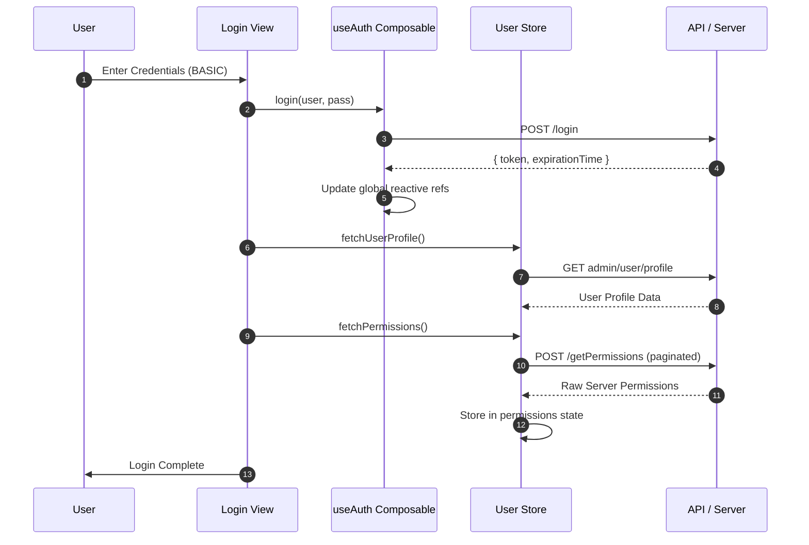

# Design Document: Login Flow - Launchpad

This document provides a comprehensive technical breakdown of the Launchpad's authentication and authorization system, structured according to the AccxUI Design Document Guide.

---

## 1. Overview
### 1.1 Objective
To provide a secure, comprehensive, and maintainable authentication and authorization system within the Launchpad.

### 1.2 Problem Statement
The application requires a robust mechanism to manage session state globally, synchronize authentication across multiple components, securely store session tokens, and evaluate required server-side permissions dynamically.

### 1.3 Success Criteria
- Reliable session tracking using reactive state and cookies mechanism.
- Efficient evaluation of boolean permission logic via lightweight, built-in store getters.
- Clean separation of concerns between API token management and user profile/permission data.

## 2. Scope
### 2.1 In Scope
- Core authentication flow (BASIC login) and SSO initialization (SAML).
- Management of global reactive authentication states (`token`, `expirationTime`).
- User profile and permission fetching.
- Client-side authorization logic evaluating "AND" and "OR" conditions natively in the store.
- Session termination and cleanup (logout).

### 2.2 Out of Scope
- User creation, registration, and password recovery mechanisms.
- Backend implementation of the SAML/SSO logic.

## 3. Background / Context
The Launchpad application evaluates permissions directly against raw server-side permissions (e.g., `APP_CATALOG_VIEW`). Often, a single UI action requires satisfying a combination of multiple server permissions. We manage these checks natively through the Pinia store's state, leveraging internal logic to recursively parse and evaluate complex boolean logic strings (e.g., `"APP_CATALOG_VIEW AND (USER_ADMIN OR CATALOG_ADMIN)"` style strings, natively handling `" AND "` and `" OR "` delimiters) against the user's fetched permissions.

## 4. Proposed Solution
### 4.1 High-Level Design
The authentication system is anchored by two major pillars:
1. **`useAuth.ts` Composable**: Central point for managing session state, using module-level reactive refs to ensure global synchronization across the app. Handles `login()`, `logout()`, and `clearAuth()`.
2. **`useUserStore.ts` (Pinia)**: A persistent store that handles the user profile (`current`), application permissions array (`permissions`), any necessary router redirects (`redirectUrl`), and the core evaluation logic via the `hasPermission` getter.

### 4.2 UI Mockup
*(N/A - Existing login flow UI matching standard platform design).*

### 4.3 Diagrams
**Sequence Diagram: Login & Authorization**

### 4.4 Data State & Storage Strategy
#### 4.4.1 Pinia State Structure
- **`useUserStore` state**: 
  - `current`: Stores the full User object fetched from the profile API.
  - `permissions`: Array of raw server-side permission strings.
  - `redirectUrl`: Temporary storage for route redirection post-login.

#### 4.4.2 Indexed DB Structure
- *(Not applicable for the core login tokens, entirely cookie/state driven).*

#### 4.4.3 Local Storage/Caching strategy
- **Cookies (`cookieHelper`)** are used to cache authentication data securely: `"token"`, `"expirationTime"`, `"maarg"`, and `"oms"`.
- Module-level reactive refs (`token`, `expirationTime`) in `useAuth.ts` mirror these cookies for instant reactivity.
- **Pinia Persist**: `useUserStore` utilizes local persistence for `current` and `permissions`.

#### 4.4.4 Data Flow & Sync
- **API → Store → UI**: Upon login, API returns the token which is set in cookies. Reactive refs detect this and update. The UI reacts to the `isAuthenticated` computed property (derived from `token` and `expirationTime`).
- Permissions retrieved from the API are loaded into the Pinia store. UI components verify access dynamically via the `hasPermission('PERM_A OR PERM_B')` getter.

### 4.5 Pseudocode / Logic Flow
**`useAuth.ts` - Login Logic:**
1. Call `POST /login` API on the OMS URL.
2. On success, set `"token"` and `"expirationTime"` cookies.
3. Synchronize the module-level reactive `token` and `expirationTime` refs.
4. Trigger `userStore.fetchPermissions()`.

**`useUserStore.ts` - fetchPermissions Logic:**
1. Call `POST /getPermissions` on OMS URL using a loop to paginate if results count > 200.
2. Store the array of raw permission IDs mapped from `docs` directly into local `permissions` state.

**`useUserStore.ts` - hasPermission(permissionId) Logic:**
1. If no `permissionId` provided, return `true`.
2. Determine if the permission string contains `" OR "`. If yes, split it and return `true` if *some* parts recursively pass `hasPermission()`.
3. If not, determine if it contains `" AND "`. If yes, split it and return `true` if *every* part recursively passes `hasPermission()`.
4. Fallback to a standard array inclusion check within the saved `permissions` array.

### 4.6 Alternatives Considered
- *CASL and boon-js:* Previously, the app evaluated permissions via abstract App Actions using boon-js logic engines and a CASL ability instance. This was removed to favor a simpler, more natively integrated and easily maintainable method using a custom recursive store getter, drastically cutting dependency overhead.

## 5. Security & Permissions
- **Cookie Security:** Authentication tokens are managed robustly via cookies. A utility method (`clearAuth`) strictly purges cookies on logout.
- **Data Access & View Grants:** Access points within the UI query the Pinia store's `hasPermission` getter directly.
- **Rule Verification Pipeline:** Logical condition verification natively handles nested `OR`/`AND` conditions dynamically just-in-time when requested by UI components.

## 6. Verification Plan
- **Login Tests:** Validate successful basic login and token injection into cookies/refs.
- **Redirection Validation:** Ensure post-SAML or standard login routing reads the `redirectUrl` correctly and falls back to default.
- **Permission Checking:** Specifically test multi-layered verification strings like `PERM_A OR PERM_B` and `PERM_A AND PERM_B` against varying mock arrays to ensure proper access is granted.
- **Logout Validation:** Ensure `logoutUrl` (SAML redirects) is handled properly and app state is reset reliably if standard logout is triggered.

## 7. Rollout Plan
- This new pattern is already integrated and fully replaces the legacy CASL/boon-js packages.

## 8. Risks & Mitigation
- **Risk:** Deeply nested logical string checks (e.g., multi-conditional ANDs/ORs) executing frequently in UI loops could theoretically impact render cycles. 
- **Mitigation:** The recursive String `split` algorithm used internally in the `hasPermission` getter handles standard depth authorization strings almost instantaneously for all practical frontend use cases.
- **Risk:** Incomplete cleanup of reactive stores on logout resulting in a leaked session view.
- **Mitigation:** The `logout()` routine sequentially resets the `userStore` state and calls `clearAuth()` to aggressively purge all cookies and refs.

## 9. References
**Reference Table: Logic Mapping**

| Responsibility | Handled By | Logic Location |
| :--- | :--- | :--- |
| **Session Tracking** | `useAuth` | Module-level `refs` & `computed`. |
| **API Token Management** | `cookieHelper` | `document.cookie` interaction. |
| **Profile Data** | `useUserStore` | `current` state property. |
| **Permission Rule Fetching** | `useUserStore` | `fetchPermissions` action. |
| **Rule Evaluation** | `useUserStore` | `hasPermission` getter via string evaluation. |
| **UI Permission Checks** | `useUserStore` | `hasPermission(String)` |
