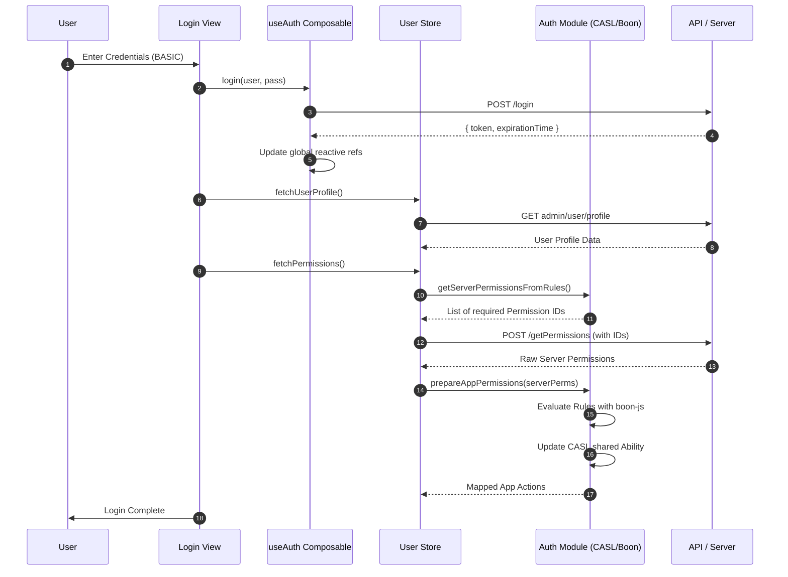

# Login Flow - Launchpad

This document provides a comprehensive technical breakdown of the Launchpad's authentication and authorization system.

---

## 1. Core Technological Components

### 1.1 Authentication Composable (`useAuth.ts`)
The `useAuth` composable is the central point for managing session state. It uses module-level reactive refs to ensure global state synchronization.

#### **Reactive State (Module Level)**
- **`token`**: A `ref` initialized from the `"token"` cookie.
- **`expirationTime`**: A `ref` initialized from the `"expirationTime"` cookie.
- **`isAuthenticated`**: A `computed` property that returns `true` if `token` exists and `expirationTime` is in the future.

#### **Key Methods**
- **`login(username, password)`**: 
    - Calls the `POST /login` API on the OMS URL.
    - On success, sets the `"token"` and `"expirationTime"` cookies.
    - Synchronizes the reactive `token` and `expirationTime` refs.
    - Triggers `userStore.fetchPermissions()`.
- **`logout(payload?)`**: 
    - emits `presentLoader`.
    - Unless `isUserUnauthorised` is true, calls the `GET /logout` API.
    - Resets the `userStore`, resets permissions via `resetPermissions()`.
    - Removes all authentication cookies and clears the reactive refs.
    - Handles SAML redirection if the logout API provides a `logoutUrl`.
- **`clearAuth()`**: a utility method that removes all auth-related cookies (`token`, `expirationTime`, `maarg`, `oms`) and resets the reactive refs.

### 1.2 User Store (`useUserStore.ts`)
A persistent Pinia store that manages the user profile and session-specific data.

#### **State Properties**
- **`current`**: Stores the full User object fetched from the profile API.
- **`permissions`**: An array of mapped application permissions (CASL rules).
- **`redirectUrl`**: Temporary storage for the URL the user was trying to access before login.

#### **Key Actions**
- **`fetchUserProfile()`**: Calls `admin/user/profile` on the Maarg URL to populate the `current` state. Also sets the global `luxon` timezone.
- **`fetchPermissions()`**: 
    1. Extracts required server permissions by calling `getServerPermissionsFromRules()`.
    2. Calls `POST /getPermissions` on the OMS URL (handles pagination if permissions > 200).
    3. Passes the raw server permissions to `prepareAppPermissions()` to generate CASL rules.
    4. Updates the local `permissions` state and calls `setPermissions()`.
- **`samlLogin(token, expirationTime)`**: Specifically handles the bootstrap process after an SSO redirect, setting cookies and fetching the profile/permissions.

### 1.3 Authorization Module (`authorization/index.ts`)
This module bridges the gap between raw server-side permissions (strings) and fine-grained application-level actions.

#### **The Role of CASL**
The app uses **CASL** for claim-based authorization. Instead of checking if a user "has permission X", the app checks if the user "can perform Action Y".

#### **The Role of boon-js**
**boon-js** is used to evaluate complex boolean logic defined in `Rules.ts`. 
- **Server Permissions**: Raw strings from the backend (e.g., `APP_CATALOG_VIEW`).
- **App Actions**: Semantic actions (e.g., `APP_CATALOG_EDIT`).
- **Evaluation**: A rule like `"APP_CATALOG_VIEW AND (USER_ADMIN OR CATALOG_ADMIN)"` is parsed and evaluated against the user's fetched server permissions.

#### **Core Logic**
- **`getServerPermissionsFromRules()`**: Scans all defined `Rules` and extracts every unique server-side permission ID mentioned in them. This ensures we only fetch what is actually needed.
- **`prepareAppPermissions(serverPermissions)`**: 
    1. Creates a lookup object where each server permission is `true`.
    2. For each App Action in `Rules.ts`, it evaluates the corresponding boolean logic using `boon-js`.
    3. If the evaluation returns `true`, that Action is added to the CASL `ability` instance via `can(Action)`.

---

## 2. Visualizing the Flow

### 2.1 Sequence Diagram: Login & Authorization

---

## 3. Reference Table: Logic Mapping

| Responsibility | Handled By | Logic Location |
| :--- | :--- | :--- |
| **Session Tracking** | `useAuth` | Module-level `refs` & `computed`. |
| **API Token Management** | `cookieHelper` | `document.cookie` interaction. |
| **Profile Data** | `useUserStore` | `current` state property. |
| **Permission Rule Fetching** | `useUserStore` | `fetchPermissions` action. |
| **Rule Evaluation** | `Authorization` | `prepareAppPermissions` + `boon-js`. |
| **UI Permission Checks** | `Authorization` | `hasPermission(Action)` via CASL. |
